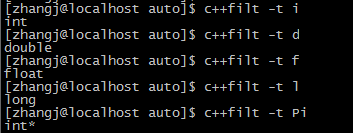

# [C++11] cc11
C++11新特性尝试的一些代码及工程集合, 测试代码主要来源于《Understanding C++11 -- Analysis and Application of New Features》.   
其实蛮多很细节的新特性, 如`User Defined Literal`, `Unrestricted Union`等, 看起来就会很少使用, 未必需要全部掌握, 但至少应熟悉下, 不至于看到类似代码都完全摸不着头脑.  

## 阅读与运行
- `Windows`: 可通过`cc_test.sln`(`VS2015`)打开所有的工程及代码, 选择某个工程进行编译及运行即可.   
- `Linux`: 
	- 编译生成`libcomm.so`, 并创建软链接  
	```   
	cd src_comm/
	g++ [-m32] -std=c++11 -fPIC -shared -Wl,-soname,libcomm.so.0 comm_tools.cc -o libcomm.so.0.0.1  
	sudo ln -s <absolute_path>/src_comm/libcomm.so.0.0.1 /usr/local/lib/libcomm.so.0  
	cd ..  
	```  

	- 编译生成待运行代码, 并运行即可  
	```  
	g++ [-m32] -std=c++11 -I../src_comm/ xxx.cc -lpthread -lcomm    
	./a.out    
	```
- `MacOSX`  
	- (注: `MacOSX`上暂未创建XCode工程, 直接命令行编译运行)     
	- `MacOSX`上的动态链接方式有所区别, 有空研究下再做成`.so/dylib`, 目前`libcomm`先直接源码编译  
	```
	clang++ [-m32] -std=c++11 -I../src_comm/ ../src_comm/comm_tools.cc xxx.cc   
	```


## 实验平台
- `Windows`: `Win10 64bit`, `Visual Studio 2015 Update 3`  
- `Linux`: `CentOS7 64bit`, `Kernel 3.10.0-229.el7.x86_64`, `gcc 4.8.5 20150623`  
- `MacOSX`: `MacBook Air (13-inch, Early 2015)`, `OSX Version 10.11.6 (15G1217)`, `Apple LLVM version 8.0.0 (clang-800.0.42.1)`  

## 实验
### src_comm, src_comm_unittest    
提供了一些通用/公用的头文件include, macro等, 方便使用, 同时提供了`CC11Printf`的实现及简单的unittest/sample实现.      

- comm_include.h  
通用的头文件include, macro等, 同时提供了`CC11Printf`的导出及变长模板实现(参考 variadic_template 项目).    

- comm_tools.cc  
提供了仅format参数版本的CC11Print的实现, 以供模板最终调用.  

- main.cc  
sample code.  

### marco_test  
确认下各个编译器下新的宏的一些定义与使用. 如`__cplusplus`, 理论上支持`C++11`的编译器值至少应是`201103L`. 原`C++98/03`的此宏定义值为`199711L`.  

- macro_check.cc  
代码文件, 编译时不支持`C++11`则编译报错. 打印`__cplusplus`宏的值, `STDC`相关的几个宏, `__VA_ARGS__`宏用法, `__func__`宏等.  

- `Windows`上测试
通过`cc_test.sln`打开后选择`marco_test`为启动项目, 编译运行即可. 

- `Linux`/`MacOSX`上测试  
`[g++|clang++] -m32 -std=c++11 macro_check.cc`  
`./a.out`  

- 关于`__cplusplus`值在各平台编译器上的定义结论  
  - `VS2015`: 仍然为`199711L`, 而不是`201103L`. 看网上有人说可能是因为还未完全支持`C++11`特性, 所以微软还没有去修改此值. 故在使用`Visual Studio`时建议通过`_MSC_VER`宏来区分.  
  	 - //MSVC++ 14.0 _MSC_VER == 1900 (Visual Studio 2015)  
	 - //MSVC++ 12.0 _MSC_VER == 1800 (Visual Studio 2013)  
	 - //MSVC++ 11.0 _MSC_VER == 1700 (Visual Studio 2012)    
	 - //MSVC++ 10.0 _MSC_VER == 1600 (Visual Studio 2010)  
	 - //MSVC++ 9.0  _MSC_VER == 1500 (Visual Studio 2008)  
	 - //MSVC++ 8.0  _MSC_VER == 1400 (Visual Studio 2005)  
	 - //MSVC++ 7.1  _MSC_VER == 1310 (Visual Studio 2003)  
	 - //MSVC++ 7.0  _MSC_VER == 1300  
	 - //MSVC++ 6.0  _MSC_VER == 1200  
	 - //MSVC++ 5.0  _MSC_VER == 1100  

  - `GCC`/`clang`: `201103L`, 测试版本 `gcc (GCC) 4.8.5 20150623 (Red Hat 4.8.5-4)` on `CentOS7`, `clang-800.0.42.1` on `OSX 10.11.6`. 

### static_assert_test
静态断言的使用尝试, 分别应用于了枚举值的检查及模板函数中的长度检查.  

- static_assert_test.cc  
代码文件, 断言错误则编译时报错, 并输出错误信息.  

- 小技巧  
可以调用无关的断言检查, 应独立于调用外面, 以增强代码的可读性.  

- `BOOST`中提供的一份可在`C++98`使用的静态断言实现  
	主要问题:  
	- 不能显示的提示错误位置和内容  
	- 不能独立写在调用代码外面, 必须写在调用里面  

- 其他  
	- 使用静态断言时, 应注意表达式只能为常量表达式, 因为需要在编译时推导出结果  

### noexcept_test
新增关键字`noexcept`用法的尝试.  

- noexcept_test.cc  
代码文件, 包含两个TestCase及`noexcept`作为操作符时的用法示例.  

- NOTE  
	- 断言适用于排除逻辑上不可能存在的状态, 异常则通常适用于可能发生的错误; 
	- `noexcept`关键字作为修饰符时, 用于指定函数是否可能会抛出异常; 作为操作符时, 则用于判断表达式是否可能会抛出异常, 多用于模板中;  
	- `C++98`中的`throw()`被`noexcept`替代, 显示指定抛出异常的类型`throw(type 1, ...)`则已在`C++11`中废弃;  
	- `delete/delete[]/析构函数`默认都是不抛出异常的, 以阻止异常扩散;  
	- 声明为`noexcept`的函数, 若抛出了异常, 则程序直接调用`std::terminate()`以暴力结束进程.  

### in-class initialization test
`C++11`中更强大的“就地”声明/初始化.  

- inclass_initialization_test.cc  
代码文件, `=`, `{}`的简单用法.  

- NOTE  
	- `C++98`仅支持静态整型/枚举型常量成员变量的就地初始化;  
	- `C++11`可支持非静态的成员变量的就地初始化, 同时支持`=`,`{}`两种形式;  
	- 关于静态成员变量的默认初始化, `C++11`与`C++98`一致, 均需要在头文件以外进行初始化, 以保证实现的唯一性.  

### sizeof_test  
`C++11`中对`sizeof`操作符的扩展, 可支持直接取非静态成员变量的长度.  

- sizeof_test.cc  
代码文件, 包含`C++11`中的新用法, 及之前编译器版本的技巧性方法.  

### friend_test  
`C++11`中`friend`关键字用法的变化, 可扩展支持模板类的`friend`声明.  

- friend_test.cc  
代码文件, 模板进行`friend`声明的示例, 编译运行时加上`UNIT_TEST`宏以观察效果.  

- using起别名(也是`C++11`中的一个新特性)  
`using Defender = DefenderT<int>`  
等同于  
`typedef DefenderT<int> Defender`  

### inherit_constructor
`C++11`中使用`using`声明来允许派生类对象直接使用基类的函数及成员. 包括普通函数/构造函数等.  

- inherit_constructor_test.cc  
代码文件, 多个`TestCase`尝试了`using`继承的使用, 及从多个基类进行派生时冲突的解决.  

- NOTE  
	- 继承时函数重名则重载  
	- 函数的默认参数不会被继承, 而是根据可能的调用情况, 继承所有的可能调用形式  
	- 从多个基类进行派生时, 若冲突则应显式定义冲突的构造函数以解决, 且指定调用基类的构造函数的版本, 否则总是会调用基类的默认构造函数
	- 从多个基类进行派生时, 总是根据继承顺序来决定调用基类构造函数的顺序, 而与`using`声明甚至显式指定调用构造函数的顺序无关  

### delegating_constructor  
`C++11`中的委托构造方法示例, 非常方便的用法.  
  
- delegating_constructor_test.cc  
代码文件, 典型的委托构造用法, 及一个简单的用模板构造函数作为target contructor的示例.  

- Note  
	- 委托构造与列表初始化不能同时使用  
	
	
### rvalue_reference  
`C++11`中的右值引用与移动语义.  

- main.cc, UnitTest.cc/h  
测试代码的入口与框架.  

- HasPtrMem.cc/h, Copyable.cc/h, Moveable.cc/h  
带有指针成员的类, 实现其拷贝构造/移动构造的代码, 包含移动构造的语义传递.  

- perfect_forwarding.cc/h  
完美转发的简单实验, 主要为模板中的使用.  

- 关键点  
	- 我理解的构造语义的触发条件: 使用右值对象/右值引用构造另外一个对象  
	- 对应的, 我理解的拷贝构造语义的触发条件: 使用左值对象/左值引用构造另外一个对象  
	- 通常的左/右值判断方法  
		- 左值(lvalue): 方法1, `=`左边即为左值; 方法2, 可以取地址、有名字则为左值  
		- 右值(rvalue): 方法1, `=`右边即为右值; 方法2, 不能取地址、没有名字则为右值  
	- `C++11`中的三种值(所有的值均属于这三者之一)  
		- 纯右值(pure rvalue): 1) 临时变量 2) 不与对象关联的值  
		- 将亡值(expiring rvalue): 将要被移动的对象  
		- 左值(rvalue): 剩余的其他值均属于左值   
	- 对右值的引用会加上其生命周期, 与引用名一致  
	- 引用类型: 
		- 左值引用(`T&`)、常量左值引用(`const T&`)、右值引用(`T&&`)、常量右值引用(`const T&&`)  
		- `const T&` 左值引用为一个万能引用类型, 可以引用任意一种引用类型  
		- 注意: 右值引用(rvalue reference) 本身是一个左值  
	- `std::move` 强制转换一个左值为右值引用, 以触发移动语义  
	- 拷贝构造函数、移动构造函数应分别根据是否需要拷贝语义、移动语义进行提供, 一般仅具有移动语义的成员变量通常为资源型, 由于不能复制      
	- 拷贝构造函数通常应提供参数为 `const T&` 的版本, 更通用  
	- `std::move/std::forward/static_cast<T&&>`基本等同, 但建议在触发移动语义时使用`move`, 完美转发时采用`forward`, 按照标准库建议的方式  
	- `C++11`的引用折叠规则(参考 3.3.6 完美转发 perfect forwarding)  
	
- 其他  
	- `VS2015`不支持关闭`Return Value Optimize`, 而此优化对本实验的影响很大, 故主要使用`GCC/clang`进行实验  
	- `GCC/clang`编译命令(打开or关闭`HAS_MOVE_CONSTRUCTOR`宏进行拷贝构造/移动构造的区别实验)  
	`[g++|clang++] -std=c++11 -I../src_comm/ [-DHAS_MOVE_CONSTRUCTOR] -fno-elide-constructors HasPtrMem.cc UnitTest.cc Copyable.cc Moveable.cc perfect_forwarding.cc main.cc`  
	- 可使用`is_reference/is_lvalue_reference/is_rvalue_reference`等几个小工具判断是何种引用类型(`UnitTest.cc->TestCase3()`)  
	- 可使用`is_move_constructible`等几个小工具判断是否有移动语义(`UnitTest.cc->TestCase8()`)  

### pod_test  
`C++`中的`POD`概念(Plain Old Data)的理解, 包括`Trivial`和`Standard Layout`两个子概念, 示例代码.  

- pod_test_types.h  
各种示例的`Trivial`, `Standard Layout`, `POD`类型的定义, 主要来源于书上.  

- main.cc  
入口及对各种定义的类型的判断示例.  

- 关键点
	- `C++11`中的`POD`类型, 需同时满足`Trivial`和`Standard Layout`两个条件  
	- `POD`的主要意义为
		- 与`C`的互操作性(兼容性), 可字节赋值, 可安全地使用`memset/memcpy`等操作之    
		- 可安全的静态初始化  
	- 类型是否为`Trivial`的判断条件
		- 对于默认构造函数(无参数构造函数), 拷贝构造函数, 移动构造函数, 析构函数, 拷贝赋值运算符, 移动赋值运算符而言, 
			- 要么未显式定义(由编译器自动生成默认的版本)
			- 要么显式定义但加上`=default`关键字(参考后续的第七章讲述)
		- 不能包含虚函数及虚基类
		- 注: 定义了有参数的构造函数不影响是否`Trivial`的判断, 但会使编译器不再生成无参数的版本, 故需要显式定义并加上`=default`关键字.   
		
	- 类型是否为`Standard Layout`的判断条件  
		- 所有非静态成员需要有相同的访问权限(public, private, protected)  
		- 满足下面两个条件之一(我自己的翻译)  
			- 最多派生程度的类(也即最后的派生类)没有非静态成员, 并且最多一个基类有非静态成员  
			- 或者 没有基类有非静态成员(也即派生类可以有非静态成员了)  
			
			摘抄下标准的英文原文:  
			either has no non-static data members in the most derived class and at most one base class with non-static data memembers, or has no base classes with non-static data members  
	
	        (关于这段英文中"in the most derived class"的解释: most修饰derived class, 表示最高级的意思, 也即字面意思为 最高级的衍生类)  
		
		- 类中的第一个非静态成员的类型与基类不同  
		- 没有虚函数和虚基类  
		- 递归定义: 所有非静态数据成员均为符合`Standard Layout`的类型, 其基类也符合`Standard Layout`    
	
	- 可通过`std::is_trivial<T>, std::is_standard_layout<T>, std::is_pod<T>`这几个模板来进行是否的判断  
	
### explicit_test
`explicit`关键字使用尝试的示例. 

- main.cc  
入口及示例代码.  

- 关键点  
	- `explicit`关键字用于禁止隐式类型转换  
	- `explicit`只对一个实参的构造函数有效. 需要多个实参的构造函数不能用于执行隐式转换, 所以无须将这些构造函数指定为`explicit`的. (摘自 《C++ Primer 5th》 P.265)  
	- `explicit`只能在类内声明时使用  
	- `C++11`中`explicit`关键字同时扩展到了自定义的类型转换操作符上, 以支持所谓的“显式类型转换”.  
  
### initializer_list  
`initializer_list`的使用尝试的示例, 包括使用列表初始化普通变量、容器类等, 以及使用`initializer_list<T>`使自定义类型支持列表初始化, 列表初始化在`Narrowing`(类型收窄)时的表现等.  

- main.cc  
入口及Test Case代码, 同时包括以`intializer_list<T>`作为函数参数/返回值等.  

- ILMyData.cc/h, ILPeople.cc/h  
自定义类型基于`initializer_list<T>`来支持列表初始化, 并与操作符重载(`[]/=`)组合后的所见即所得的初始化方式.  

- 关键点  
	- `initializer_list`可用于普通变量初始化/容器类型初始化/自定义类型初始化等;  
	- `C++11`中的几种初始化方式:  
		- `=`加上赋值表达式, 如 `int a = 3 + 4;`  
		- `=`加上花括号(列表初始化), 如`int a = {3 + 4};`  
		- 圆括号, 如`int a = (3 + 4);`  
		- 花括号(列表初始化), 如`int a {3 + 4};`  
		其中后两种方式可用于堆内存上的初始化, 如`int * b = new int(10); double* d = new double {1.2f};`  
	- 自定义类型/函数参数/函数返回值支持列表初始化的方式:  
		(`C++11`内部的STL支持列表初始化也是采用的这个方法)  
		`include <intializer_list>`, 然后定义一个 `initializer_list<T> ` 作为参数的函数/构造函数或作为返回值的函数  
	- `initializer_list`列表初始化方法与其他初始化方式相比的重要优势: 防止类型收窄  
		- 类型收窄(Narrowing)的含义: 简单理解即初始化变量时会丢失精度/表达不完整  
		- 如何防止类型收窄: 原编译器通常会报warning, 而在`C++11`中采用列表初始化, 则编译器将报error, 以更好的保证安全性. (注: 实测下来, `vs2015/clang`报错了，但`GCC`并没有...)  

### Unresricted_Union
`C++11`中对于`Union`使用的扩展, 包括可支持非POD类型成员, 可支持静态成员函数(仅非匿名Union)等.  

- main.cc  
入口及测试代码, 尝试了`Unrestricted_Union`的用法, 及验证了初始化时的一些行为.  

- 关键点  
	- `Unrestricted_Union`可支持非POD类型成员, 在非匿名时同时可支持静态成员函数;  
	- `Unrestricted_Union`的初始化行为, 如`T t = {0}`时, 默认类似于`memset(&t, 0, sizeof(t))`, 但若`T t = {1}`时, 默认行为为初始化`t`第一个成员, 其他成员相当于未初始化. 使用时需要注意;  
	- `Unrestricted_Union`含有非POD类型成员时, 默认构造函数会被移除, 需通过`placement new`的方式显式定义构造函数;   

- 其他  
	- 在静态成员的支持上, 不同编译器又有所不同. GCC与标准一致, 不能有静态成员变量, 仅支持静态成员函数, 但vs2015和clang++可以支持`const static`的静态成员变量..  

### user_defined_literal  
`C++11`中允许用户自定义字面量的方便用法尝试.  

- main.cc  
入口及测试代码.  

- 关键点  
	- `C++11`中支持用户自定义Literal的方式, 是定义其Literal函数;  
	- Literal函数的形参可支持整型(仅`unsigned long long`), 浮点数(仅`long double`), `const char*`, `char`四种;  
		- 整型和浮点型若实参超过了`unsigned long long/long double`的表示范围, 则会自动调用`const char*`版本;  
		- 形参为`const char*`的函数, 参数表还会自带一个`size`, 由编译器自动解析填入;  
	- 杂项  
		- Literal函数声明时`""`与`_C`之间需要有空格(实验下来vs2015/clang++无所谓, 但GCC要求有);  
		- 一般建议以下划线开始为后缀, 以免与内置的如L/LL/f等后缀冲突;  

### inline_namespace  
`C++11`中`inline namespace`的用法示例, 及ADL(Argument-Dependent name lookup)的行为示例.  

- main.cc  
入口及示例代码.  

- 关键点  
	- `C++11`中新增的`inline namespace`, 允许了父namespace中直接访问`inline namespace`中的内容, 不必再展开/加前缀;  
	- `C++11`中允许直接在父namespace中定义/特化模板;  
	- 关于ADL(Argument-Dependent name lookup), 即调用函数时若在已知namespace找不到, 则会去参数的namespace中搜索; 实际会破坏封装性, 应慎用之. 但应了解下, 以便看到类似代码时能了解其原理.  


### using_alias  
`C++11`中可以使用`using`起别名且支持模板别名的示例.  

- main.cc  
入口及示例代码.  

- 关键点  
	- `using`和`typedef`起别名没有本质区别, 但`using`可支持模板别名而`typedef`不支持, 也即`using`更加灵活些  
	- 可以使用`is_same<T1, T2>`模板判断两个类型是否相同  
	
### SFIENA  
`C++11`中对SFIENA(Subsitution failure is not an error)规则进行了进一步的描述, 尝试试用.  

- main.cc  
入口及示例代码.  

- 杂项  
	- 某种意义上来讲, SFIENA有点类似于模板函数的重载;  
	- 具体的SFIENA规则在`C++11`中细化了什么, 其实没太理解...遗留下, 有些经验后再回顾..  

### auto_decltype  
`C++11`中`auto`和`decltype`关键字的使用及限制, 及`auto`与`decltype`组合使用追踪/推导返回类型的用法.   

- main.cc  
入口及使用示例代码.  

- 静态类型语言与动态类型语言的区分  
	- 简单的区分  
		- 定义时不需要关注类型, 则为动态  
		- 定义时必须要显式指明类型, 则为静态  
	- 严谨些的定义  
		- 运行时进行类型检查, 则为动态  
		- 编译时进行类型检查, 则为静态  

- `auto`的一些使用细则  
	1. `auto`与`*`,`&`的使用  
		- 若想定义指针类型, `auto*`等同于`auto`  
		- 若想定义引用类型, 必须显式`auto&`  
	2. `auto`与`cv(const, volatile)`的使用  
		- `auto`定义默认不会带右值的`cv`属性, 除非定义的是引用或者指针  
			(遗留问题: 貌似还没了解到可直接判断变量是否具有`cv`属性的方法? 故无法验证? 此问题也不太影响应用, 留待有机会验证)  
	3. `auto`一行定义多个变量时  
		- 从左至右推导, 实际仅第一个变量的类型是有`auto`推导出来的  
	4. 标准/编译器对`auto`使用的4个限制  
		- `auto`不能用于形参  
		- `auto`不能用于非静态成员变量  
		- `auto`不能用于数组  
		- `auto`不能用于模板实例化参数   

- `decltype`与`auto`的主要异同  
	- `decltype`通过表达式推导, 而`auto`通过赋值推导;  
	- `decltype`能够带走cv限制符(对象的成员不会继承), 而`auto`不能  
	- `decltype`可直接推导出引用类型, 而`auto`必须显式使用`auto&`定义引用类型  
	- 冗余的`&`, `*`等两者都会忽略    

	
- `decltype`的推导规则 `decltype(e)`  
	- 如果`e`是一个没有带括号的标记符表达式(id-expression)或者类成员访问表达式, 那么`decltype(e)`就是`e`所命名的实体类型; 若`e`是一个被重载的函数, 则会导致编译器错误;  
	- 否则, 假设`e`的类型是`T`, 如果`e`是一个将亡值, 那么`decltype(e)`为`T&&`;  
	- 否则, 假设`e`的类型是`T`, 如果`e`是一个左值, 则`decltype(e)`为`T&`;  
	- 否则, 假设`e`的类型是`T`, 则`decltype(e)`为T.  

- `decltype`的应用  
	- `decltype`与`auto`一起使用, 追踪/推导返回类型  
	- 与`typedef/using`一起使用, 为推导出的类型起别名  
	- 重用匿名类型(不推荐的应用方式)  

- 杂项  
	- `typeid(x).name()`输出的类型名, `g++/clang++`编译时输出的是类型的简写形式, 诸如`i/d/l/f/Pi/...`, 需要通过`c++flit -t <类型简写>`来还原原始类型名称, 示例诸如:  
	  
	- `typeid(x).name()`输出的类型名, `vs2015`输出的是完整的类型名, 更方便直接查看.  
	- RTTI机制
		- 即`typeid()`所返回的信息，实际对应`type_info`数据, 可在运行时获得;  
		- 此机制有一定的运行时开销, 理论上编译器允许关闭(如`GCC`的`-fno-rttion`选项, 虽然我的实验平台上不支持)  
	- 关于`typeof`  
		- 此为`GCC`编译器的扩展, 而非语言特性; `C++11`中使用`auto`和`decltype`可完全替代之;  
	

### range_for   
`C++11`中基于范围的`for`的用法.  

- main.cc  
入口及示例代码.  

- 可用的前提条件  
	- 迭代的范围必须是可确定的  
		- 若是数组, 必须长度已知, 第一个元素和最后一个元素中间的范围即为迭代范围  
		- 若是类, 需要有`begin()`和`end()`, `begin()`和`end()`中间的范围即为迭代范围  
	- 迭代的对象必须支持`++`, `==`等操作符  
		- `STL`中的容器都是支持的   
		- 用户自定义类, 需要提供这些操作符的实现  

- 注意事项  
	- 若迭代需要修改内容, 则声明迭代对象时应声明为引用类型  
	- 使用`auto`声明迭代对象, 此变量不会是迭代器, 而是迭代器解引用后的值  

- for_each  
	- 模板库中原本也有一个`for_each`的实现, 通过迭代调用外部处理函数来实现功能, 内部实际就是一个循环, 仅省去了程序员写`for`循环的动作, 貌似意义不大     

### strong_typed_enum   
`C++11`中的强类型枚举的用法.  

- main.cc   
入口及示例代码.  

- `C++98`中的`enum`的缺陷  
	- 类型名及成员名都是全局可见的, 属于非强作用域类型  
	- 会默认隐式转换为整型进行比较  
	- 占用存储空间及符号性不确定  

- `C++11`中的`strong-typed enum`的优势  
	- 强作用域, 成员名称不会输出到其父作用域空间  
	- 转换限制, 不会与整型隐式地相互转换  
	- 可以指定底层类型, 默认为`int`, 可以指定为除`wchar_t`外的所有整型  

- 杂项  
	- 使用上`enum class`与`enum struct`没有任何区别  
	- 当程序中需要"数值的名字"的时候, 通常的三种实现方式  
		- 宏  
		- 枚举  
		- 静态常量  

### intelligent_pointer_and_gc  
`C++11`中的智能指针用法, 及垃圾回收相关的一些讨论.  

- main.cc  
入口及示例代码.  

- `C++11`中的智能指针  
	- `unique_ptr`: 唯一地引用某个堆内存, 不能拷贝赋值给其他指针(即不能让其他指针同时引用), 可以move给其他`unique_ptr`  
	- `shared_ptr`: 可以多个指向同一块堆内存, 实现上采用引用计数的方式, 引用计数减为0时指向的内存会被析构  
	- `weak_ptr`: 可以指向`shared_ptr`引用的内存, 但不影响引用计数, 从而可以用来判断内存的有效性  
	均可以调用`reset()`接口显式地标记指针不再引用内存   

- 垃圾回收方法的分类
	- 基于引用计数的垃圾回收器(reference counting garbage collector)  
	- 基于跟踪处理的垃圾回收器(tracing garbage collector)  
		- 标记-清除(Mark-Sweep)  
		- 标记-整理(Mark-Compact)  
		- 标记-拷贝(Mark-Copy)  

- `C++11`对垃圾回收的支持   
	- `C++11`标准为最小垃圾回收定义了方法/接口, 但基本上编译器都未实现...仅做mark..

- 杂项  
	- `C++98`中的`auto_ptr`在`C++11`中废弃, 由上述三个指针替代之  
	- 可以使用`get_pointer_safety()`接口获取编译器是否支持最小垃圾回收, 但我的实验平台上`GCC-4.8.5`连这个接口都未支持, `VS2015`和`clang++`上可以获取出不支持最小垃圾回收.. 

### constexpr  
`C++11`中`constexpr`常量表达式/常量函数的用法, 可用于编译时常量的定义与计算.  

- main.cc  
入口及示例代码.  

- `const`与`constexpr`的区别  
	- 通常情况下, `const`用于描述运行时常量, 而`constexpr`用于描述编译时常量(可编译时计算值).   
	- 以下两句通常没有区别, 但若`cosntexpr`修饰的变量没有被用到, 可能编译器并不会为其产生数据, 而`const`修饰的则总是会产生数据  
		- const int i = 1;  
		- constexpr int j = 1;  

- 常量表达式函数的要求:　
	- 函数体只有单一的`return`语句(不产生实际代码的语句可以不影响, 如`static_assert/using/typedef`等)    
	- 函数必须返回值(不能是`void`函数)  
	- 在使用前必须已有定义  
	- `return`返回语句表达式中不能使用非常量表达式的函数、全局数据, 且必须是一个常量表达式  

- `constexpr`用于自定义类型  
	- 需要自定义常量构造函数  
		- 函数体必须为空  
		- 初始化列表只能由常量表达式来赋值   
	- 常量性体现在类型上, 证据就是成员变量可供内部的常量函数使用  

- `constexpr`可以实现编译时期计算, 可完成类似于模板元编程的功能, 可编译时递归.  

### variadic_template  
`C++11`中变长模板的讨论及示例.  

- main.cc  
入口及示例代码.   

- 关键点  
	- `C++11`中可支持变长模板, 包括变长类型模板与非类型模板, 具体实现上是采用变长参数包的方式进行封装, 编译时递归解包;  
	- 关于用途的初步认识, 可用于实现`C++11` style 的`printf`, 类型安全;  
	- 可使用`sizeof...`获取变长参数包中的参数个数;  
	- TODO: 积累一定经验后再回顾进阶的内容...   

### quick_exit   
`C++11`中新增的`quick_exit`, 理论上比`exit`更加快速退出, 因为不会去调用析构释放内存, 而直接丢给操作系统.   

- main.cc  
入口及示例代码.   

- 退出的几个函数对比: `terminate/abort/exit/quick_exit`   
	- `terminate/abort`: 异常退出   
		- 通常`terminate`的实现是调用`abort`   
		- `terminate通常在出现没有捕获的异常时调用   
		- `abort`被调用时会有`SIGABRT`信号   
	- `exit/quick_exit`: 正常退出   
		- 理论区别: `exit`会调用析构函数, `quick_exit`不会; 正常退出时操作系统会回收内存, 故若程序想要快速退出, 可以不去做显式的内存回收工作. 此即`quick_exit`的目标用途.   
		- 实验结果: `exit`与`quick_exit`在vs2015和GCC下都没有调用析构, 所以可以认为没区别... 用clang++编译时没有找到`quick_exit`的支持       


### atomic   
`C++11`中支持的原子类型, 及有关memory_order的使用示例.  

- main.cc  
入口及示例代码.   

- 关键点   
	- 互质的本质, 需要同步的总是数据而不是代码   
	- `C++11`已内置了一部分atomic类型, 也可以使用`atomic<T>`自定义(需删除拷贝构造、移动构造和拷贝赋值运算符)   
	- 关于特殊的`atomic_flag`类型: lock free, 仅有`test_and_set`与`clear`两种操作, 可用于实现自旋锁.   

- memory_order   
	- 保证代码顺序一致性的两点:  
		- 编译器保证原子操作的指令间顺序不变   
		- 处理器对原子操作的汇编指令的执行顺序不变(weak order处理器出于优化性能的考虑, 会打乱看似不影响的指令的执行顺序)   
	- `C++11`中memory_order七种枚举值   
		- `memory_order_relaxed`: 不对执行顺序做任何保证   
		- `memory_order_acquire`: 本线程中, 所有后续的读操作必须在本条原子操作完成后才能执行   
		- `memory_order_release`: 本线程中, 所有之前的写操作完成后才能执行本条原子操作   
		- `memory_order_acq_rel`: 同时包含`memory_order_acquire`和`memory_order_release`   
		- `memory_order_consume`: 本线程中, 所有后续的有关本原子类型的操作, 必须在本条原子操作完成之后执行   
		- `memory_order_seq_cst`: 全部存取都按顺序执行(默认值)   
	- 典型的4种内存顺序模型:  
		- 顺序一致的   
		- 松散的(relax)   
		- release-acquire   
		- release-consume   
	- 对于并行编程来说, 可能最根本的还是思考如何将大量计算的问题, 按需分解成多个独立的、能够同时运行的部分, 并找出真正需要在线程间共享的数据   

### thread_local_storage   
`C++11`中对线程局部存储(TLS, thread local storage)的支持, 通过`thread_local`关键字.   

- main.cc  
入口及示例代码.   

- 杂项   
	- 原各编译器分别都自定义了TLS标准, 如`g++/clang++/xlc++`中的`__thread`;   
	- 在TLS中一个常常被讨论的问题: TLS变量的静态/动态分配问题, 即程序一开始分配还是线程开始运行时分配(标准并未强制规定);    
	- `C++11`对TLS仅做了语法上的统一, 并未做性能上的规定     

### nullptr   
`C++11`中新增的`nullptr`关键字示例代码.   

- main.cc  
入口及示例代码.   

- 关键点    
	- `nullptr`主要解决的问题: 原`NULL`的二义性问题, 即是C++中的`0`or C中的`(void*)0`, 又表示指针, 重载时意义表达不清;   
	- `nullptr`的类型`nullptr_t`定义: `typedef decltype(nullptr) nullptr_t`, 通过类型推导的   
	- `C++11`标准定义的一些关于`nullptr_t`和`nullptr`的规则:   
		- 所有的`nullptr_t`类型的数据都是等价的, 行为也完全一致;   
		- `nullptr_t`类型的数据可以隐式地转换为任意一个指针类型;   
		- `nullptr_t`类型数据不能转换为非指针类型, 即使使用`reinterpret_cast<非指针类型>(nullptr_t)`也是不可以的.(vs2015上是可以的, 啪啪打脸);   
		- `nullptr_t`类型数据不适用于算术运算表达式(vs2015上是可以的, 啪啪打脸);   
		- `nullptr_t`可以用于关系运算符表达式.   
	- 在模板的类型推导时, `nullptr`会被推导成`T`, 而不是`T*`; 若要推导成`T*`, 则需要显式`(void*)nullptr`;   
	- `nullptr`不支持取地址操作;   

- 杂项   
	- `(void*)0`为`C`的用法, `C++`中并不支持   

### default_delete_control   
`C++11`中的默认函数控制 `=default`,`=delete`的用法.   

- main.cc  
入口及示例代码.   

- 关键点   
	- `=default`: 显式定义默认的版本(让编译器自动生成实现)   
	- `=delete`: 显式删除默认的版本(指示编译器不要自动实现)   
	- `explicit`与`=delete`不要同时使用, 没有任何好处, 会带来问题   

### lambda   
`C++11`中的lambda函数相关使用与讨论.   

- main.cc  
入口及示例代码.   

- 关键点   
	- lambda函数语法   
		- [capture](parameters)mutable -> return-type {statement}   
			- [capture] 捕获列表.  
			- (parameters) 参数列表. 不需要传递则可省略.   
			- mutable 修饰符, 默认情况下, lambda函数总是一个const函数, mutable可以取消其常量性. 使用此修饰符时参数列表不可省略(即使参数为空).   
			- ->return-type 返回类型. 不需要返回值或返回值明确(可推导)时, 都可以省略.  
			- {statement} 函数体.   
	- 捕捉列表(多个捕捉项时可以以逗号分隔)   
		- [var]  表示值传递方式捕捉变量var   
		- [=]    表示值传递方式捕捉所有父作用域的变量(包括this)   
		- [&var] 表示引用传递方式捕捉变量var   
		- [&]    表示引用传递方式捕捉所有父作用域的变量(包括this)   
		- [this] 表示值传递方式捕捉当前的this指针  
	- 捕捉列表的值传递时机  
		- 值传递方式捕捉变量, 值是在lambda函数定义时决定. 所以定义后修改值, 并不会影响lambda函数中看到的值.  
		- 引用传递方式捕捉变量, 值是在lambda函数调用时决定.   
	- 与`C++11`中的lambda等价的是有常量operator()的仿函数. 此仿函数是编译器实现lambda函数的一种形式.     
	- lambda 并不是仿函数的完全替代者, 主要原因是捕捉列表的限制(标准规定仅能捕捉父作用域中的自动变量, 编译器通常会扩展一些)   
	- 使用lambda替代仿函数通常应满足的条件:   
		- 是局限于一个局部作用域中使用的代码逻辑   
		- 这些代码逻辑需要被作为参数传递   

- 杂项   
	- lambda函数可以向具有同样原型的函数指针转换(不能有捕获变量), 反之不行.      
	- lambda与仿函数的共同内涵: 都具有初始状态, 同时接受参数进行计算.   
	- 居然没提供 `const T&` 的捕捉传递方式?!!   

		    


### align   
`C++11`中对对齐的支持示例.   

- main.cc  
入口及示例代码.  

- 关键点   
	- `C++11`中添加的两个关键字   
		- `alignof`: 查看对齐方式(vs2015上不支持查看变量的对齐方式, G++上可以)     
		- `alignas`: 设置对齐方式  
	- `STL`中的支持: `align/align_storage/align_union`    
		- 这个没太完全理解, 有必要时再实验   

- 杂项   
	- `C`中经常有些超长结构体需要对齐, 原来的典型做法是手动加入`padding`数据. 现在则可以使用对齐关键字/宏(`C11`中也有对应的支持).   
   
### attribute   
`C++11`中支持的通用属性扩展.  

- main.cc  
入口及示例代码.   

- 关键点   
	- `C++11`中目前定义了两个属性, 以帮助编译器可做优化:   
		- [[noreturn]]: 告知编译器此函数不会返回(如必然抛出异常、中断程序等)   
		- [[carries_dependency]]: 可携带memory_order信息, 未深入研究, 需要时再研究      
	- 编译器对属性的一些扩展   
		- `GNUC`: __attribute__ (( attribute-list ))   
			- 常用属性如 noreturn, format, const, aligned等   
		- `MSVC`: __declspec(extended-decl-modifier)   
			- 常用属性如 noreturn, oninline, align, dllimport, dllexport等   

### unicode   
`C++11`中对Unicode的支持的一些扩展.   

- main.cc  
入口及示例代码.   

- 关键点   
	- `C++11`中引入的类型   
		- `char16_t`: 用于存储utf-16编码的字符串,同时有对应的`std::u16string`   
		- `char32_t`: 用于存储utf-32编码的字符串, 同时有对应的`std::u32string`       
		- 原`char`类型: 用于存储utf-8的字符串, 同时有对应的`std::string`   
	- 前缀声明类型让编译器产生数据   
		- u8: 表示字符串为utf-8编码, 如 u8"你好啊" 为utf-8字符串      
		- u : 表示字符串为utf-16编码, 如 u"你好啊" 为utf-16字符串   
		- U : 表示字符串为utf-32b编码, 如 U"你好啊" 为utf-32字符串   
	- 字符串中直接表示Unicode字符   
		- `\u`加4个十六进制数: 表示一个UTF-16字符, 如`\u4F60`   
		- `\U`加8个十六进制数: 表示一个UTF-32字符, 如`\U0001d10b`   
	- 对Unicode支持的影响因素   
		- 语言   
		- 源文件的保存格式   
		- 编译过程   
		- 输出设备(如Linux的Shell是否支持该编码类型的输出)   
	- UTF-8/16/32的应用   
		- UTF-8为变长编码, 优势在于存储时节约空间, 但缺点是不能直接数组式的访问, 故不太适合在内存中操作(比如计算第N个元素的时间复杂度不再是O(1)). 定长的UTF-16和UTF-32则更适合在内存中操作.   
		- 所以, 一般总是倾向于在I/O读写时采用UTF-8, 在内存中则采用UTF-16/32.   

### raw_string_literal   
`C++11`中对原生字符串字面量的支持.   

- main.cc  
入口及示例代码.   

- 关键点   
	- `C++11`中支持raw_string_literal的格式   
		- R"(内容)" : 示例R"(hello, \n world)"   
		- 对Unicode支持的raw_string_literal, 可以使用`u8R`, `uR`, `UR`这几个前缀, 分别对应UTF-8, UTF-16, UTF-32编码   
	

## 其他杂项  
- 区分三个编译器的宏  
	- `VS2015`: `_MSC_VER`  
	- `Clang`: `__clang__`  
	- `GCC`: `!defined(__clang__) && defined(__GUNC__)`  
	- 注: `Clang`编译器覆盖了`GNUC`的宏, 故同时需要区分时, 对于`GCC`要确定没有定义`__clang__`  

## Reference Links
- http://stackoverflow.com/questions/70013/how-to-detect-if-im-compiling-code-with-visual-studio-2008  
- http://en.cppreference.com/w/cpp/compiler_support  
- http://stackoverflow.com/questions/28166565/detect-gcc-as-opposed-to-msvc-clang-with-macro  


### Contacts
Author's Email: wangyoucao577@gmail.com.
