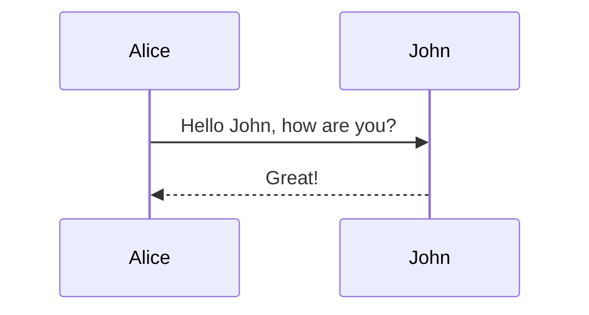
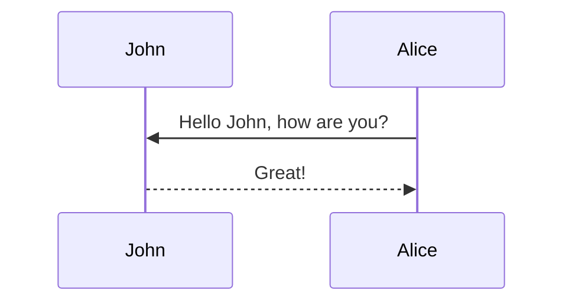
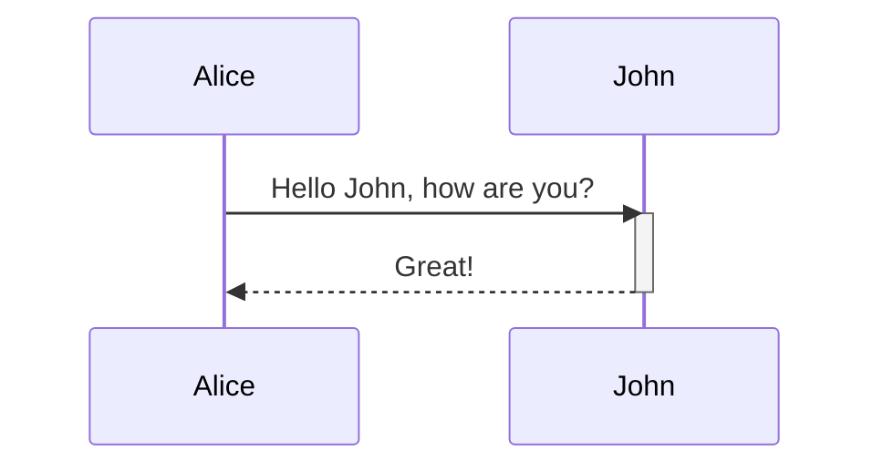
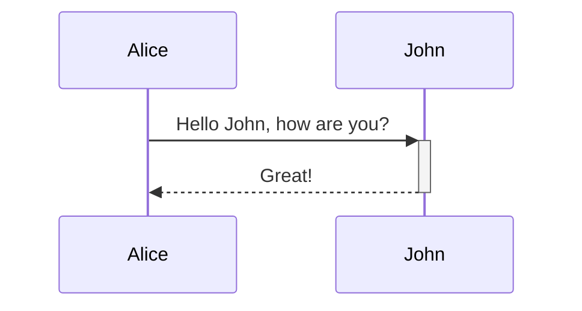
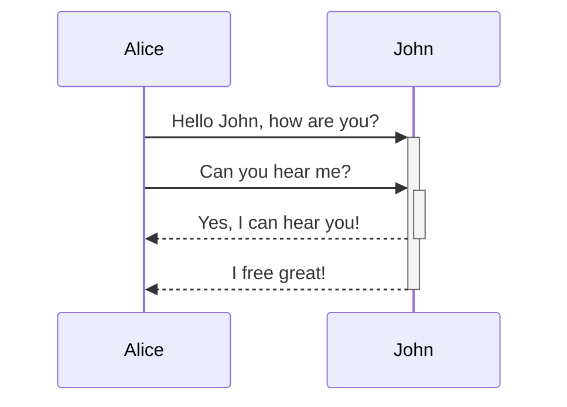
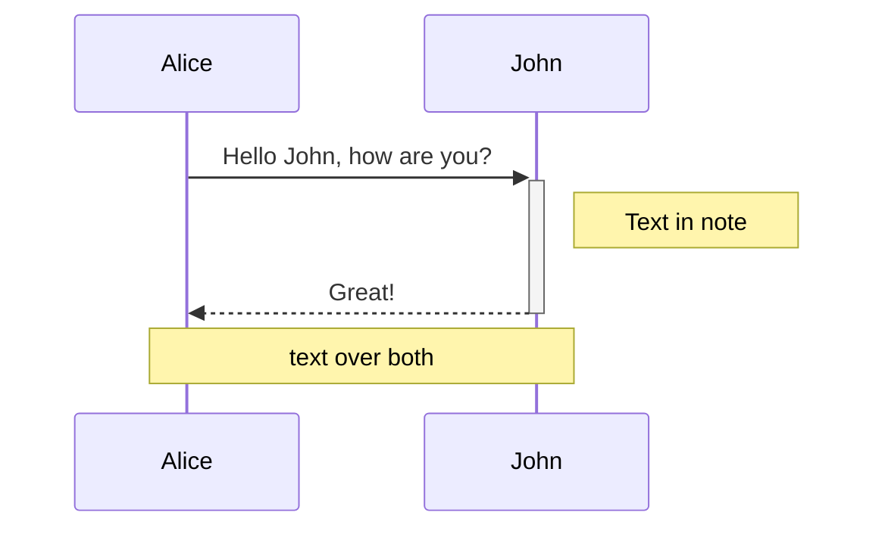
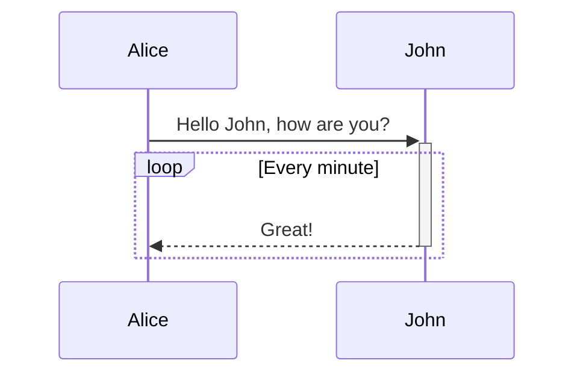

# Try Mermaid
- `Mermaid`: Generation of diagrams and flowcharts from text in a similar manner as markdown.    
    - 目前主要支持画`Flowchart`, `Gantt diagram`和`Sequence Diagram`三种图.    
    - 设计思路类似于`Markdown`, 即文本化编辑和保存, 需要呈现时通过`Mermaid`进行解析画图呈现. 这样做的好处是编辑过程可以版本管理, 编辑、分享、使用也都更轻量更容易. 也支持导出为`PDF/PNG/SVG`等多种格式保存.     
    - 基于`javascript`实现, 所以可以直接用于直接在前端网页上呈现.    

## 我的实验 
我的应用场景主要是需要画图时, 直接简单编辑一个`Mermaid`格式的文本, 然后生成图片. 所以主要尝试[Mermaid CLI](https://github.com/mermaidjs/mermaid.cli), [Mermaid Live Editor](https://mermaidjs.github.io/mermaid-live-editor) 以及 [Mermaid Preview For VSCode](https://marketplace.visualstudio.com/items?itemName=vstirbu.vscode-mermaid-preview) 这几个工具. 

### 实验环境
- `Mermaid Live Editor powered by mermaid 8.0.0-rc.8`
- `VSCode 1.25.1 on Win10 1803`

### Install
- Install [Mermaid CLI](https://github.com/mermaidjs/mermaid.cli)
`sudo npm install -g mermaid.cli`    
可能会遇到`npm ERR! Failed at the puppeteer@1.6.1 install script`错误, 解决方法:    
`sudo npm install -g mermaid.cli --unsafe-perm=true --allow-root`
```sh
$ mmdc --version
0.5.1
$ mmdc -h

  Usage: mmdc [options]

  Options:

    -V, --version                                   output the version number
    -t, --theme [theme]                             Theme of the chart, could be default, forest, dark or neutral. Optional. Default: default (default: default)
    -w, --width [width]                             Width of the page. Optional. Default: 800 (default: 800)
    -H, --height [height]                           Height of the page. Optional. Default: 600 (default: 600)
    -i, --input <input>                             Input mermaid file. Required.
    -o, --output [output]                           Output file. It should be either svg, png or pdf. Optional. Default: input + ".svg"
    -b, --backgroundColor [backgroundColor]         Background color. Example: transparent, red, '#F0F0F0'. Optional. Default: white
    -c, --configFile [configFile]                   JSON configuration file for mermaid. Optional
    -C, --cssFile [cssFile]                         CSS file for the page. Optional
    -p --puppeteerConfigFile [puppeteerConfigFile]  JSON configuration file for puppeteer. Optional
    -h, --help                                      output usage information
```

- Install [Mermaid Preview For VSCode](https://marketplace.visualstudio.com/items?itemName=vstirbu.vscode-mermaid-preview)
在`VSCode`的`Extensions`中搜索`Mermaid Preview`并安装即可. 

### Try to Draw Flowchart
- Single node with text and different shapes


- Link between nodes


- With special characters


- Subgraphs


- Sample with title


### Try to Draw Sequence Diagram
- first sample

- change participants order

- alias

- Message Format
`[Actor][Arrow][Actor]:Message Text`
    - 6 types of arrows    
| ->   | 实线 无箭头  |    
| -->  | 虚线 无箭头  |    
| ->>  | 实线 有箭头  |    
| -->> | 虚线 有箭头  |    
| -x   | 实线 最后带x |    
| --x  | 虚线 最后带x |    
- Activations (两种方法, 同样的效果)


- Activations Stack

- Notes

- Loop

- Alt(if/else), Opt(if without else)    
TODO:    

### Try to Draw Gantt Diagram
这个暂时用不到, 先不玩了. 有需要的时候再来玩玩.    

### NOTE
- `Github`的`Markdown`还没有支持嵌入`Mermaid`, 所以还是得先转为图片再插入`Markdown`.    
    - 在`VSCode`中可以以代码形式来写`mermaid`嵌入在`Markdown`中, Preview 时可支持直接预览为图片(需要安装 [Mermaid Preview For VSCode](https://marketplace.visualstudio.com/items?itemName=vstirbu.vscode-mermaid-preview)). 如本文档中所写格式.   
    - 所以在`VSCode`的`Markdown`中写`Mermaid`代码, 最后用[Mermaid Live Editor](https://mermaidjs.github.io/mermaid-live-editor) 或 [Mermaid CLI](https://github.com/mermaidjs/mermaid.cli) 来根据`mermaid`内容生成图片是一个不错的选择.    

## Reference links
- [Mermaid Documentation](https://mermaidjs.github.io/)
- [Mermaid on Github](https://github.com/knsv/mermaid)
- [Mermaid Live Editor](https://mermaidjs.github.io/mermaid-live-editor)
- [Mermaid CLI](https://github.com/mermaidjs/mermaid.cli)
- [Mermaid Preview For VSCode](https://marketplace.visualstudio.com/items?itemName=vstirbu.vscode-mermaid-preview)
- [How to add title to flowchart?](https://github.com/knsv/mermaid/issues/556#issuecomment-363182217)
- [Mermaid Flowchart Syntax](https://mermaidjs.github.io/flowchart.html)
- [Mermaid Sequence Diagram Syntax](https://mermaidjs.github.io/sequenceDiagram.html)
- [Mermaid Gantt Diagram Syntax](https://mermaidjs.github.io/gantt.html)